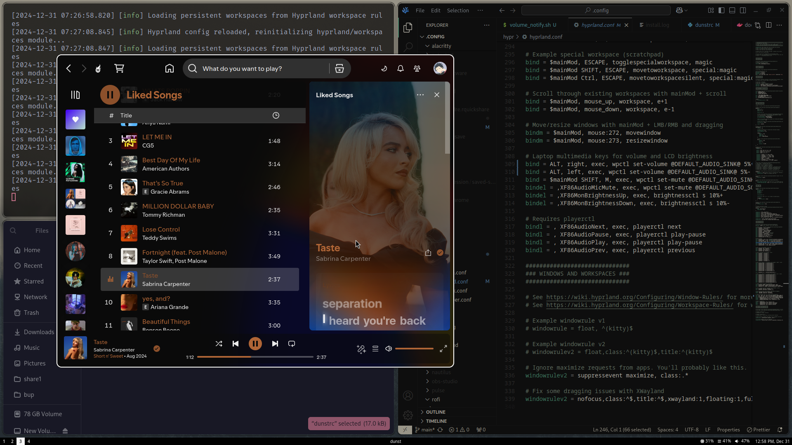
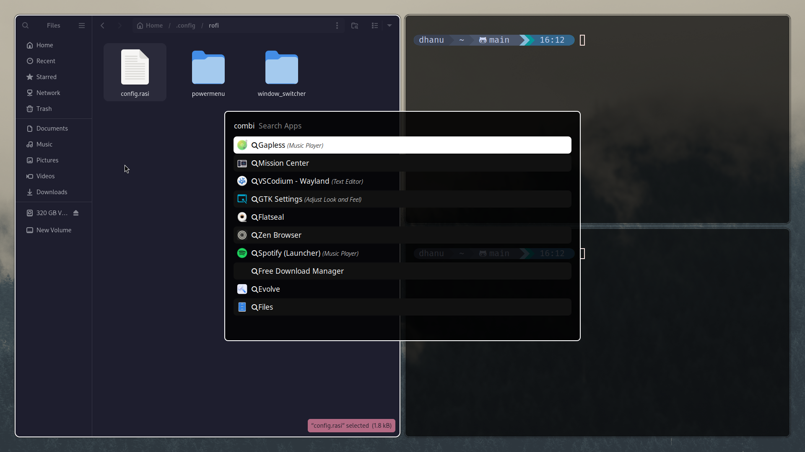

# My Linux Window Manager Config

This is my personal **Hyprland** configuration tailored to my needs. It includes custom settings for window management, terminal emulators, app launchers, and more.

## What I Use:
- **Window Manager**: Hyprland
- **Terminal**: Alacritty
- **Editor**: Neovim
- **App Launcher**: Rofi
- **Status Bar**: Hyprpanel
- **File Manager**: Nautilus
- **Other Tools**: MPV, GIMP, Kitty, custom scripts

## Disclaimer:
This setup is specific to my system and not recommended for you, as it most likely won't suit your needs. Feel free to copy and modify any part of it to make it yours. Most of this is adapted from others, and I’ve tailored it to my preferences.

## Key Features:
- Tiling & floating window layouts
- Custom keybindings and scripts
- Adwaita cursor theme integration
- Fully integrated environment with apps like Rofi and Hyprpanel

## Screenshot:

---

This setup might require some tweaking for your system—especially if you’re not blessed with the almighty power of an Nvidia GPU. But hey, if you know, you know!